# PrivacyLens Architecture Diagrams

## 1. System Architecture Overview

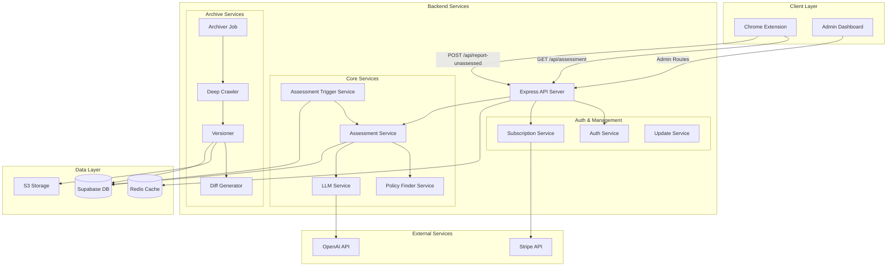

## 2. Database Schema

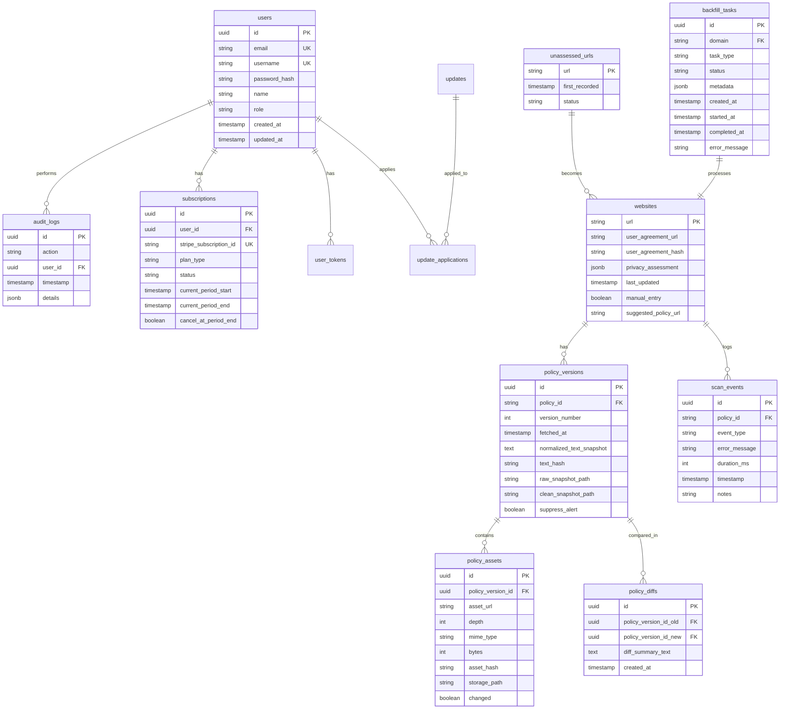

## 3. Assessment Request Flow

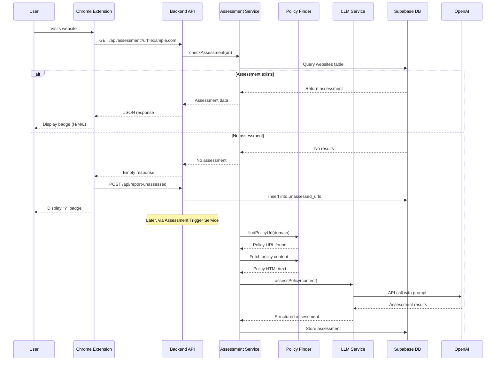

## 4. Deep Crawler Archive Flow

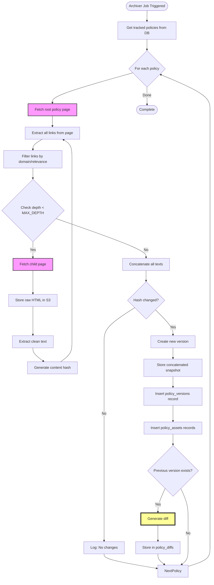

## 5. Component Interaction Map

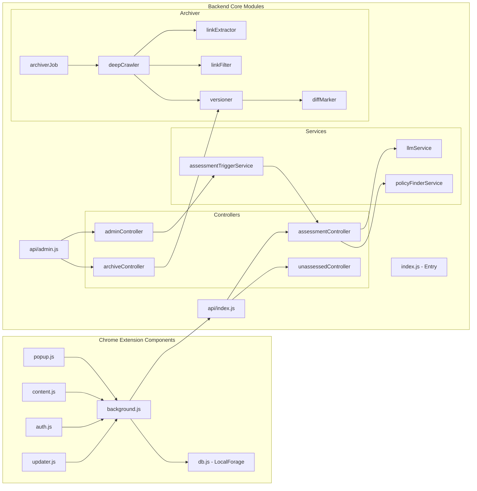

## 6. Assessment Processing State Machine

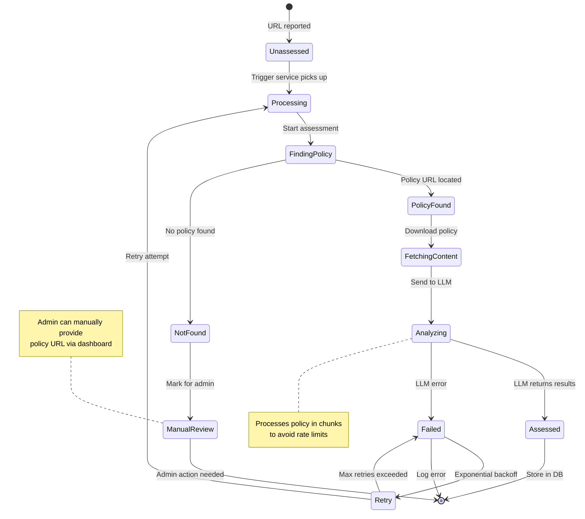

## 7. Data Flow Through System

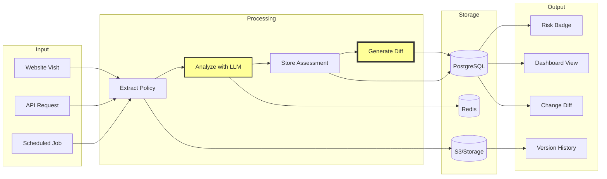

## 8. Memory Issue - Before and After Fix

### Before Fix (Memory Overflow)
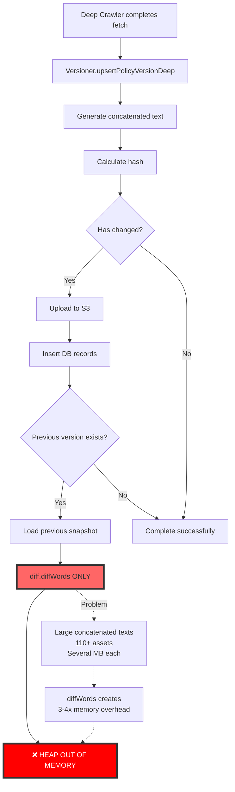

### After Fix (Hybrid Approach)
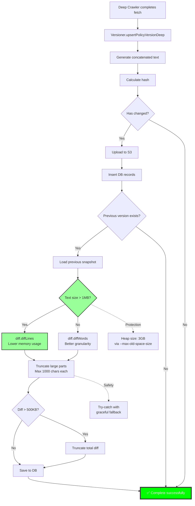

## 9. Authentication & Session Flow

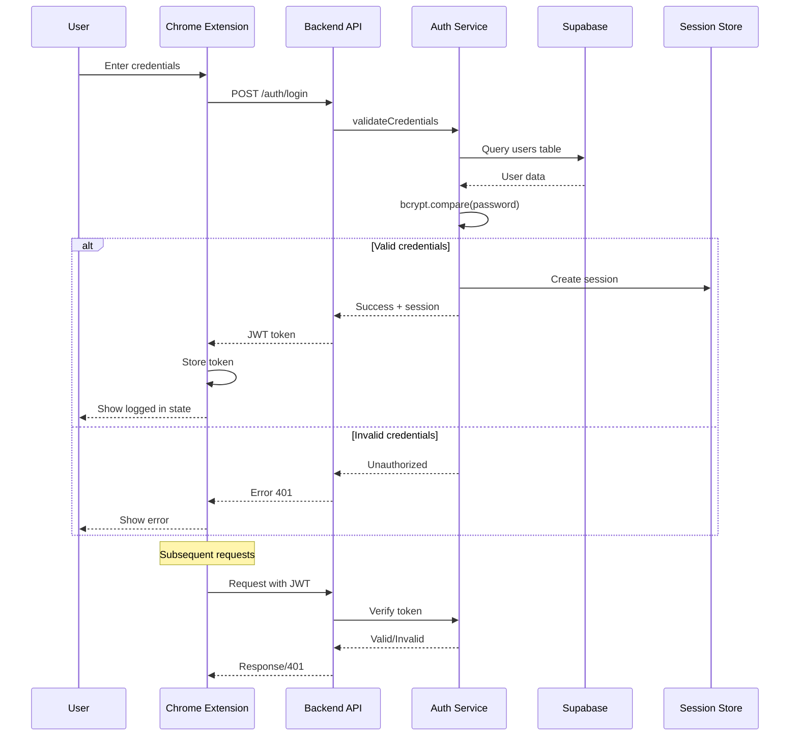

## 10. Update Distribution System

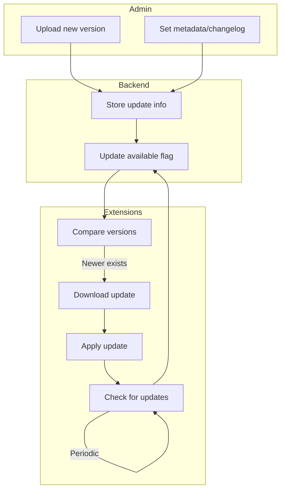

## 11. Hybrid Diff Strategy Decision Tree

```mermaid
flowchart TD
    START([Diff Generation Start]) --> CALC[Calculate combined text size]
    CALC --> CHECK_SIZE{Size > 1MB?}
    
    CHECK_SIZE -->|No| WORD[Use diff.diffWords]
    CHECK_SIZE -->|Yes| LINE[Use diff.diffLines]
    
    WORD --> PROCESS[Process changes]
    LINE --> PROCESS
    
    PROCESS --> FOREACH[For each change part]
    FOREACH --> CHECK_PART{Part > 1000 chars?}
    
    CHECK_PART -->|Yes| TRUNC_PART[Truncate to 1000 chars<br/>Add char count]
    CHECK_PART -->|No| KEEP[Keep full part]
    
    TRUNC_PART --> BUILD[Build diff summary]
    KEEP --> BUILD
    
    BUILD --> CHECK_TOTAL{Total > 500KB?}
    CHECK_TOTAL -->|Yes| TRUNC_TOTAL[Truncate to 500KB<br/>Add truncation note]
    CHECK_TOTAL -->|No| FINAL[Final diff summary]
    
    TRUNC_TOTAL --> FINAL
    
    FINAL --> TRY[Try to save to DB]
    TRY --> CATCH{Error occurred?}
    
    CATCH -->|Yes| FALLBACK[Save placeholder message:<br/>'[Diff generation failed]']
    CATCH -->|No| SUCCESS[✅ Diff saved successfully]
    
    FALLBACK --> END([End])
    SUCCESS --> END
    
    style CHECK_SIZE fill:#ff9,stroke:#333,stroke-width:2px
    style LINE fill:#9f9,stroke:#333,stroke-width:2px
    style WORD fill:#9ff,stroke:#333,stroke-width:2px
    style SUCCESS fill:#0f0,stroke:#333,stroke-width:2px
    style FALLBACK fill:#f99,stroke:#333,stroke-width:2px
```

## 12. Memory Optimization Impact

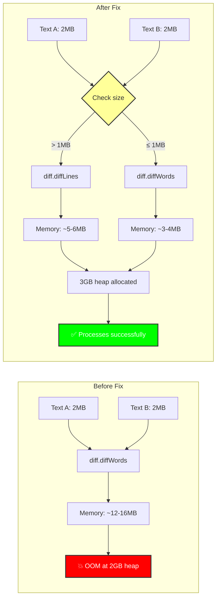