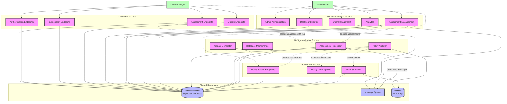

# PrivacyLens Process Separation Architecture Diagram

The following diagram illustrates the proposed process separation architecture for the PrivacyLens backend system.

## Legend

- **Solid lines**: Direct API calls or database access
- **Dotted lines**: Indirect dependencies or asynchronous communication
- **Green boxes**: Client applications
- **Pink boxes**: Server processes
- **Blue boxes**: Shared resources

## Process Communication Flow

1. **Chrome Plugin → Client API Process**: Direct API calls for assessments, authentication, etc.
2. **Client API Process → Message Queue**: Asynchronous tasks like reporting unassessed URLs
3. **Background Jobs Process ← Message Queue**: Consumes messages to process tasks
4. **Background Jobs Process → Database**: Stores processed data
5. **Archive API Process → Database**: Retrieves archive data to serve to clients
6. **Archive API Process → S3 Storage**: Retrieves stored policy assets

This architecture allows each process to operate independently while sharing data through the database and communicating asynchronously through the message queue.
